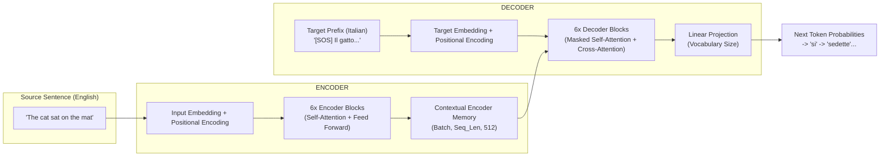
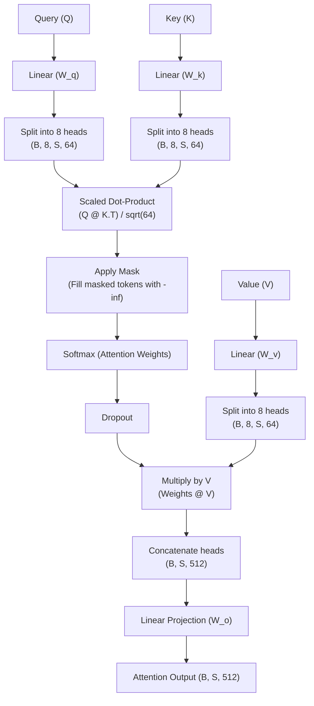
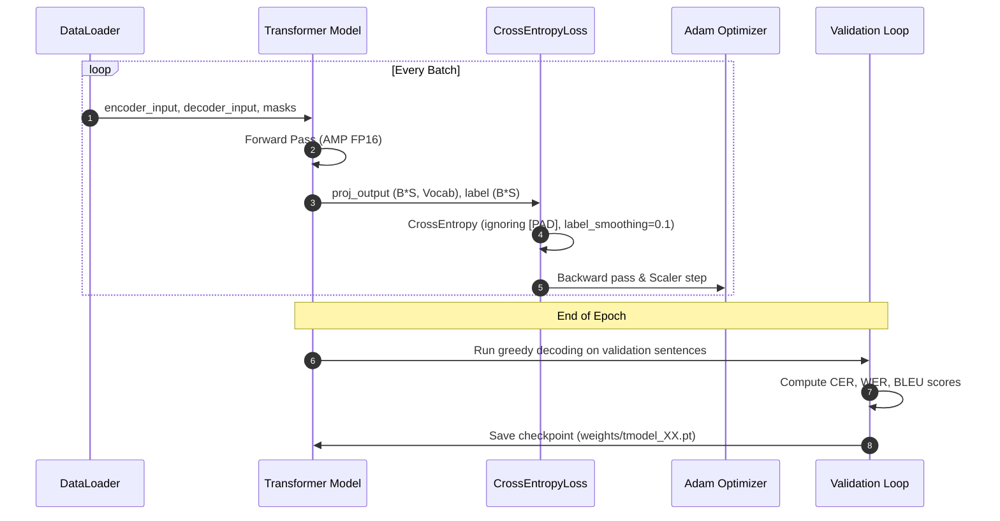

# Transformer from Scratch — Architecture & Codebase Guide

This document is a complete walkthrough of the Transformer from scratch project you wrote, explaining every component, the underlying mathematics, tensor dimensions, masking logic, and data flow.

---

## 1. High-Level Overview

Your project is a pure **PyTorch implementation of the original Transformer architecture** from the landmark paper *["Attention Is All You Need" (Vaswani et al., 2017)](https://arxiv.org/abs/1706.03762)*. 

It is designed as a **Sequence-to-Sequence (Seq2Seq)** neural machine translation system trained to translate **English into Italian** using the Hugging Face OPUS Books dataset.



---

## 2. Codebase Map & File Structure

Here is how each file in your project connects together:

```text
transformers/
├── model.py              # Pure PyTorch neural network modules (from scratch)
├── dataset.py            # Dataset wrapper, padding, token offsets, and causal masks
├── config.py             # Hyperparameters, directory paths, and checkpoint resolution
├── train.py              # DataLoader setup, training loop, validation metrics, TensorBoard
├── translate.py          # Standalone inference engine & interactive translation CLI
├── test_transformer.py   # Unit test suite verifying layers, shapes, and decoding
└── requirements.txt      # Python dependencies
```

---

## 3. Component-by-Component Walkthrough: `model.py`

### 3.1. Input Embedding (`InputEmbedding`)
* **Purpose**: Maps discrete token IDs (integers from $0$ to $V-1$) into continuous dense vectors of dimension $d_{model} = 512$.
* **Formula**:
  $$\text{Embedding}(x) \times \sqrt{d_{model}}$$
* **Why multiply by $\sqrt{d_{model}}$?** As described in Section 3.4 of the paper, multiplying embeddings by $\sqrt{d_{model}}$ (e.g., $\sqrt{512} \approx 22.6$) scales up the embedding values relative to the positional encodings added next, preserving semantic token information.
* **Shapes**: `(Batch, Seq_Len) -> (Batch, Seq_Len, d_model)`

---

### 3.2. Positional Encoding (`PositionalEncoding`)
* **Purpose**: Transformers have no recurrent recurrence ($RNN$) or convolutions, so they are permutation-invariant. Positional encodings inject positional order into the vectors.
* **Formulas**:
  $$PE_{(pos, 2i)} = \sin\left(\frac{pos}{10000^{2i/d_{model}}}\right)$$
  $$PE_{(pos, 2i+1)} = \cos\left(\frac{pos}{10000^{2i/d_{model}}}\right)$$
* **Implementation detail**:
  ```python
  div_term = torch.exp(torch.arange(0, d_model, 2).float() * (-math.log(10000.0) / d_model))
  ```
  This is mathematically identical to $\frac{1}{10000^{2i/d_{model}}}$ using the identity $e^{\ln(x)} = x$, but computationally faster and numerically stable.
* **Registered Buffer**: `self.register_buffer('pe', pe)` tells PyTorch that `pe` is part of the model state (saved in checkpoints) but has no gradients (`requires_grad=False`).
* **Shapes**: Adds `(1, Seq_Len, d_model)` to the embedded input.

---

### 3.3. Layer Normalization (`LayerNormalization`)
* **Purpose**: Normalizes activations across the channel/feature dimension ($d_{model}$) for each token independently, stabilizing gradient flow.
* **Formula**:
  $$y = \alpha \odot \left(\frac{x - \mu}{\sigma + \epsilon}\right) + \beta$$
* **Parameters**:
  * $\alpha$ (`self.alpha`): Learnable scale parameter initialized to $1$.
  * $\beta$ (`self.bias`): Learnable shift parameter initialized to $0$.
  * $\epsilon = 10^{-6}$: Prevents division by zero.
* **Shapes**: `(Batch, Seq_Len, d_model) -> (Batch, Seq_Len, d_model)`

---

### 3.4. Multi-Head Attention (`MultiHeadAttention`)
This is the core engine of the Transformer.



* **Number of heads ($h$)**: $8$.
* **Head dimension ($d_k$)**: $d_{model} / h = 512 / 8 = 64$.
* **Scaled Dot-Product Attention Formula**:
  $$\text{Attention}(Q, K, V) = \text{softmax}\left(\frac{Q K^T}{\sqrt{d_k}} + M\right) V$$
* **Why split into multiple heads?** Multi-head attention allows the model to jointly attend to information from different representation subspaces at different positions (e.g., one head attends to grammar agreements, another to direct objects, another to tense).

---

### 3.5. Feed-Forward Network (`FeedForwardBlock`)
* **Purpose**: A position-wise two-layer fully connected network applied to each position separately and identically.
* **Formula**:
  $$\text{FFN}(x) = \max(0, x W_1 + b_1) W_2 + b_2$$
* **Dimensions**: Expands from $d_{model} = 512$ up to $d_{ff} = 2048$, applies **ReLU** and dropout, and projects back down to $512$.

---

### 3.6. Residual Connection & Pre-LN Architecture (`ResidualConnection`)
* **Your implementation uses Pre-LayerNorm**:
  ```python
  def forward(self, x, sublayer):
      return x + self.dropout(sublayer(self.norm(x)))
  ```
* **Why Pre-LN?** In original Transformer (Post-LN), layer norm is applied *after* the addition: `norm(x + sublayer(x))`. Pre-LN applies normalization *before* the sublayer. Modern architectures (GPT-2/3/4, LLaMA) prefer Pre-LN because gradients pass unimpeded through the residual stream, making training significantly more stable and eliminating warmup sensitivity.

---

### 3.7. Encoder & Decoder Stacks
* **`EncoderBlock` & `Encoder`**:
  1. Self-Attention (Queries, Keys, Values all come from the input sequence).
  2. Feed-Forward Block.
  3. Stacks 6 identical blocks in `Encoder` followed by a final `LayerNormalization`.

* **`DecoderBlock` & `Decoder`**:
  1. **Masked Self-Attention**: Prevents target positions from attending to future tokens (causal autoregressive constraint).
  2. **Cross-Attention**: Queries come from the decoder sublayer; **Keys and Values come directly from the Encoder's final output**. This is where the translation occurs!
  3. Feed-Forward Block.
  4. Stacks 6 identical blocks in `Decoder` followed by a final `LayerNormalization`.

---

### 3.8. Projection Layer (`ProjectionLayer`)
* **Purpose**: Maps the decoder hidden states from $d_{model} = 512$ to target vocabulary dimension ($V_{tgt} = 22,463$).
* **Formula**: $\log(\text{softmax}(x W + b))$.

---

## 4. Dataset & Masking Mechanics: `dataset.py`

### 4.1. Token Layout in a Training Batch
For each English sentence $S$ and Italian sentence $T$:

| Tensor Name | Layout / Structure | Max Length |
| :--- | :--- | :--- |
| **`encoder_input`** | `[SOS]` + Source Tokens + `[EOS]` + `[PAD]` $\dots$ | $350$ |
| **`decoder_input`** | `[SOS]` + Target Tokens + `[PAD]` $\dots$ | $350$ |
| **`label`** | Target Tokens + `[EOS]` + `[PAD]` $\dots$ | $350$ |

The target input is offset by 1 position from the label! At position $i$, the decoder receives `decoder_input[i]` and must predict `label[i]` (the next token). This is classic **Teacher Forcing**.

---

### 4.2. Masking Explained
There are two masks operating in your model:

1. **Encoder Mask (`encoder_mask`)**:
   * Shape: `(Batch, 1, 1, Seq_Len)`
   * Logic: `encoder_input != [PAD]`
   * Purpose: Prevents self-attention from computing attention scores over meaningless `[PAD]` tokens.

2. **Decoder Mask (`decoder_mask`)**:
   * Shape: `(Batch, 1, Seq_Len, Seq_Len)`
   * Logic: `(decoder_input != [PAD]) & causal_mask(Seq_Len)`
   * The **Causal Mask** is an upper-triangular matrix set to `False` above the diagonal:
     $$\begin{pmatrix} 1 & 0 & 0 & 0 \\ 1 & 1 & 0 & 0 \\ 1 & 1 & 1 & 0 \\ 1 & 1 & 1 & 1 \end{pmatrix}$$
   * Purpose: Token 1 can only see Token 1. Token 2 can see Tokens 1 and 2. Tokens cannot look ahead into the future!

---

## 5. Training & Loss: `train.py`



* **Loss Function**: `nn.CrossEntropyLoss(ignore_index=PAD_ID, label_smoothing=0.1)`
  * `ignore_index`: Gradients are not computed for padding tokens.
  * `label_smoothing=0.1`: Replaces one-hot hard target probabilities ($1.0$) with soft probabilities ($0.9$ for correct token, $0.1 / V$ shared across others). Prevents the model from becoming overconfident and drastically improves generalization.
* **Optimizer**: Adam with learning rate $\eta = 10^{-4}$, $\beta_1 = 0.9$, $\beta_2 = 0.999$, $\epsilon = 10^{-9}$.
* **GPU Acceleration**: PyTorch AMP (`torch.amp.autocast('cuda')` and `GradScaler`) provides FP16 mixed precision on Tensor Cores.

---

## 6. Autoregressive Inference: `translate.py`

During training, all target tokens are known in advance (Teacher Forcing). During inference / translation, target tokens are generated **one at a time**:

1. Feed source English sentence into the **Encoder** $\to$ compute `encoder_output` once.
2. Initialize decoder with `[SOS]` token.
3. Pass `decoder_input` and `encoder_output` through the **Decoder**.
4. Project last position $\to$ pick token with highest probability (`argmax`).
5. Append new token to `decoder_input`.
6. Repeat steps 3–5 until the model produces `[EOS]` or reaches `max_len`.
7. Decode token IDs back to human-readable Italian words using the target tokenizer.

---

## 7. Hyperparameter Reference Table

| Hyperparameter | Value in `config.py` | Description |
| :--- | :--- | :--- |
| `batch_size` | `8` | Number of sentence pairs per training step |
| `num_epochs` | `20` | Full training passes over the dataset |
| `lr` | `1e-4` | Initial learning rate for Adam optimizer |
| `seq_len` | `350` | Maximum sentence sequence length |
| `d_model` | `512` | Dimensionality of model embeddings & hidden states |
| `n_layers` | `6` | Number of Encoder and Decoder blocks |
| `n_heads` | `8` | Number of parallel attention heads |
| `d_ff` | `2048` | Feed-Forward inner hidden dimension |
| `dropout` | `0.1` | Dropout probability across all layers |
