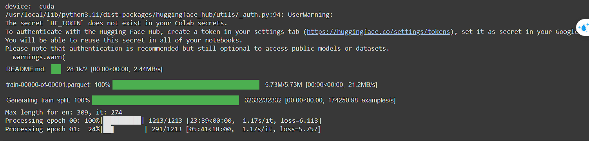

# Transformer from Scratch

A clean, modular implementation of the original Transformer architecture (*Attention Is All You Need*) in PyTorch, featuring training on the Hugging Face OPUS Books (English to Italian) dataset, autoregressive inference, and validation tracking.



---

## Features
- **Pure PyTorch Architecture**: Complete implementation of Multi-Head Attention, Positional Encoding, Pre-LN Residual Connections, Feed-Forward blocks, and Encoder/Decoder stacks.
- **Dataset & Tokenization**: WordLevel tokenization using Hugging Face `tokenizers`, dynamic causal and padding masking.
- **Validation & Metrics**: Autoregressive greedy decoding evaluated against validation sets with Character Error Rate (CER), Word Error Rate (WER), and BLEU scores logged to TensorBoard.
- **Interactive Translation**: CLI and REPL tool ([translate.py](translate.py)) to translate sentences using trained checkpoints.
- **Modern Tooling**: Managed with [`uv`](https://github.com/astral-sh/uv) for fast and reliable dependency resolution.
- **Unit Tests**: Full test suite covering model components, masks, and autoregressive generation.

---

## Quick Start with `uv`

### 1. Environment Setup
Create a virtual environment and install dependencies:
```bash
# Create virtual environment with Python 3.12
uv venv --python 3.12

# Activate environment
source .venv/bin/activate

# Install dependencies
uv pip install -r requirements.txt
```

### 2. Run Tests
Verify all architectural components and greedy decoding:
```bash
pytest test_transformer.py
```

### 3. Train the Model
Train on the OPUS Books English-Italian dataset:
```bash
python train.py
```
Checkpoints will be saved automatically to `weights/` and TensorBoard logs to `runs/`.

To resume from the latest checkpoint or a specific epoch:
```python
# In config.py:
cfg['preload'] = 'latest'  # or '05' for weights/tmodel_05.pt
```

### 4. Monitor Training with TensorBoard
```bash
tensorboard --logdir runs
```

### 5. Translation / Inference
Translate custom English sentences into Italian:

```bash
# Translate a single sentence
python translate.py "I love learning about artificial intelligence."

# Specify a specific checkpoint
python translate.py "Hello, how are you?" --checkpoint weights/tmodel_10.pt

# Interactive mode (REPL)
python translate.py
```

---

## Model Architecture

```python
transformer = build_transformer(
    src_vocab_size=10000,
    tgt_vocab_size=10000,
    src_seq_len=50,
    tgt_seq_len=50,
    d_model=512,
    n_layers=6,
    n_heads=8,
    dropout=0.1,
    d_ff=2048
)
```

```
Transformer(
  (encoder): Encoder(
    (layers): ModuleList(
      (0-5): 6 x EncoderBlock(
        (self_attention_block): MultiHeadAttention(
          (w_q): Linear(in_features=512, out_features=512, bias=False)
          (w_k): Linear(in_features=512, out_features=512, bias=False)
          (w_v): Linear(in_features=512, out_features=512, bias=False)
          (w_o): Linear(in_features=512, out_features=512, bias=False)
        )
        (feed_forward_block): FeedForwardBlock(
          (linear1): Linear(in_features=512, out_features=2048, bias=True)
          (linear2): Linear(in_features=2048, out_features=512, bias=True)
        )
        (residual_connections): ModuleList(
          (0-1): 2 x ResidualConnection(
            (norm): LayerNormalization()
          )
        )
      )
    )
    (norm): LayerNormalization()
  )
  (decoder): Decoder(
    (layers): ModuleList(
      (0-5): 6 x DecoderBlock(
        (self_attention_block): MultiHeadAttention(
          (w_q): Linear(in_features=512, out_features=512, bias=False)
          (w_k): Linear(in_features=512, out_features=512, bias=False)
          (w_v): Linear(in_features=512, out_features=512, bias=False)
          (w_o): Linear(in_features=512, out_features=512, bias=False)
        )
        (cross_attention_block): MultiHeadAttention(
          (w_q): Linear(in_features=512, out_features=512, bias=False)
          (w_k): Linear(in_features=512, out_features=512, bias=False)
          (w_v): Linear(in_features=512, out_features=512, bias=False)
          (w_o): Linear(in_features=512, out_features=512, bias=False)
        )
        (feed_forward_block): FeedForwardBlock(
          (linear1): Linear(in_features=512, out_features=2048, bias=True)
          (linear2): Linear(in_features=2048, out_features=512, bias=True)
        )
        (residual_connections): ModuleList(
          (0-2): 3 x ResidualConnection(
            (norm): LayerNormalization()
          )
        )
      )
    )
    (norm): LayerNormalization()
  )
  (src_embed): InputEmbedding(
    (embedding): Embedding(10000, 512)
  )
  (tgt_embed): InputEmbedding(
    (embedding): Embedding(10000, 512)
  )
  (src_pos): PositionalEncoding()
  (tgt_pos): PositionalEncoding()
  (projection_layer): ProjectionLayer(
    (proj): Linear(in_features=512, out_features=10000, bias=True)
  )
)
```